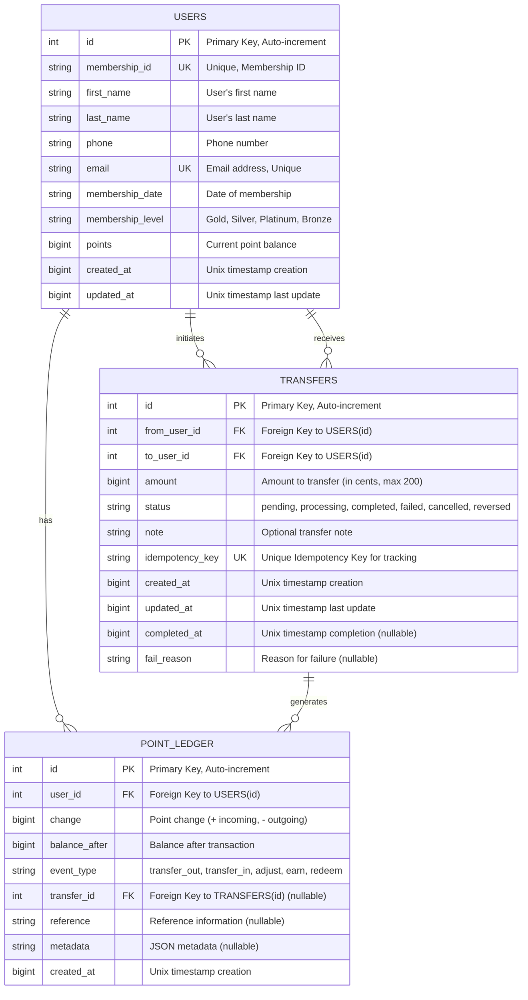

# Database Documentation

## Entity Relationship Diagram



## Database Schema Details

### USERS Table
Stores user information and current point balance.

| Column | Type | Constraints | Description |
|--------|------|-------------|-------------|
| `id` | INTEGER | PRIMARY KEY AUTOINCREMENT | Unique user identifier |
| `membership_id` | TEXT | UNIQUE NOT NULL | Membership identifier |
| `first_name` | TEXT | NOT NULL | User's first name |
| `last_name` | TEXT | NOT NULL | User's last name |
| `phone` | TEXT | NOT NULL | Contact phone number |
| `email` | TEXT | UNIQUE NOT NULL | Email address |
| `membership_date` | TEXT | NOT NULL | Date of membership |
| `membership_level` | TEXT | NOT NULL | Tier level (Gold/Silver/Platinum/Bronze) |
| `points` | INTEGER | NOT NULL DEFAULT 0 | Current point balance |
| `created_at` | INTEGER | NOT NULL | Creation timestamp (Unix) |
| `updated_at` | INTEGER | NOT NULL | Last update timestamp (Unix) |

### TRANSFERS Table
Records all point transfer transactions between users.

| Column | Type | Constraints | Description |
|--------|------|-------------|-------------|
| `id` | INTEGER | PRIMARY KEY AUTOINCREMENT | Internal transfer ID |
| `from_user_id` | INTEGER | NOT NULL, FK(users.id) | Sender user ID |
| `to_user_id` | INTEGER | NOT NULL, FK(users.id) | Receiver user ID |
| `amount` | INTEGER | NOT NULL CHECK (amount > 0) | Transfer amount in cents (max 200) |
| `status` | TEXT | NOT NULL CHECK (status IN (...)) | Transfer status |
| `note` | TEXT | NULL | Optional transfer note |
| `idempotency_key` | TEXT | UNIQUE NOT NULL | Unique tracking key |
| `created_at` | INTEGER | NOT NULL | Creation timestamp |
| `updated_at` | INTEGER | NOT NULL | Last update timestamp |
| `completed_at` | INTEGER | NULL | Completion timestamp |
| `fail_reason` | TEXT | NULL | Failure reason if applicable |

**Indexes:**
```sql
CREATE INDEX idx_transfers_from ON transfers(from_user_id);
CREATE INDEX idx_transfers_to ON transfers(to_user_id);
CREATE INDEX idx_transfers_created ON transfers(created_at);
```

### POINT_LEDGER Table
Append-only transaction history for audit trail and balance verification.

| Column | Type | Constraints | Description |
|--------|------|-------------|-------------|
| `id` | INTEGER | PRIMARY KEY AUTOINCREMENT | Ledger entry ID |
| `user_id` | INTEGER | NOT NULL, FK(users.id) | User ID |
| `change` | INTEGER | NOT NULL | Point change (positive/negative) |
| `balance_after` | INTEGER | NOT NULL | Balance after transaction |
| `event_type` | TEXT | NOT NULL CHECK (event_type IN (...)) | Type of event |
| `transfer_id` | INTEGER | NULL, FK(transfers.id) | Reference transfer (if applicable) |
| `reference` | TEXT | NULL | Additional reference |
| `metadata` | TEXT | NULL | JSON metadata |
| `created_at` | INTEGER | NOT NULL | Creation timestamp |

**Indexes:**
```sql
CREATE INDEX idx_ledger_user ON point_ledger(user_id);
CREATE INDEX idx_ledger_transfer ON point_ledger(transfer_id);
CREATE INDEX idx_ledger_created ON point_ledger(created_at);
```

## Relationships

### 1. USERS → TRANSFERS (One-to-Many)
- One user can **initiate** many transfers (as sender)
- One user can **receive** many transfers (as receiver)
- **Cardinality**: 1:M
- **Enforcement**: Foreign keys `from_user_id` and `to_user_id`

### 2. USERS → POINT_LEDGER (One-to-Many)
- One user has many ledger entries
- **Cardinality**: 1:M
- **Enforcement**: Foreign key `user_id`

### 3. TRANSFERS → POINT_LEDGER (One-to-Many)
- One transfer generates multiple ledger entries (one for sender, one for receiver)
- **Cardinality**: 1:M
- **Enforcement**: Foreign key `transfer_id`

## Data Integrity Rules

### Transfer Status Flow
```
pending → processing → completed
                    ↘ failed → reversed/cancelled
```

### Point Ledger Event Types
- **transfer_out**: Points sent to another user
- **transfer_in**: Points received from another user
- **adjust**: Manual point adjustment
- **earn**: Points earned (e.g., promotion)
- **redeem**: Points redeemed for rewards

### Constraints
1. Transfer amount must be > 0 and ≤ 200 (cents = 2.00)
2. Sender and receiver must be different users
3. Sender must have sufficient points
4. All transfers are atomic (all-or-nothing)
5. Ledger entries are append-only (immutable)
6. Idempotency key must be unique across all transfers

## Access Patterns

### Query Optimization
Indexes are created for:
- Finding transfers by sender: `idx_transfers_from`
- Finding transfers by receiver: `idx_transfers_to`
- Sorting transfers by creation date: `idx_transfers_created`
- Getting user's ledger history: `idx_ledger_user`
- Linking ledger to transfer: `idx_ledger_transfer`
- Sorting ledger entries by date: `idx_ledger_created`

### Common Queries
```sql
-- Get all transfers for a user (as sender or receiver)
SELECT * FROM transfers 
WHERE from_user_id = ? OR to_user_id = ?
ORDER BY created_at DESC;

-- Get user's point history
SELECT * FROM point_ledger 
WHERE user_id = ? 
ORDER BY created_at DESC;

-- Verify final balance
SELECT balance_after FROM point_ledger 
WHERE user_id = ? 
ORDER BY created_at DESC 
LIMIT 1;
```

## Scalability Considerations

1. **Ledger Table Growth**: Point ledger grows indefinitely (append-only). Consider archiving old records.
2. **Transfer Status Tracking**: Current design supports eventual consistency for status updates.
3. **User Points Column**: Denormalized for performance. Always verify against ledger in critical operations.
4. **Idempotency Key**: Prevents duplicate transfers from retried requests.

## Migration History

### Version 1.0 (Initial)
- Created USERS table with membership and points tracking
- Created TRANSFERS table with atomic transaction support
- Created POINT_LEDGER table for audit trail
- Added indexes for query optimization
